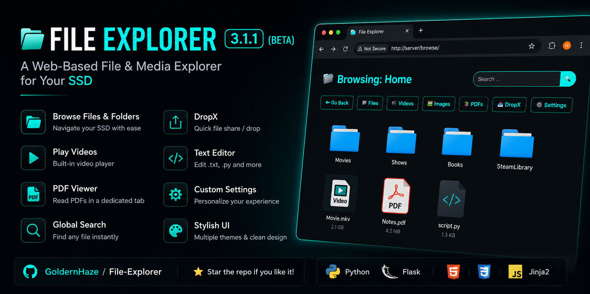
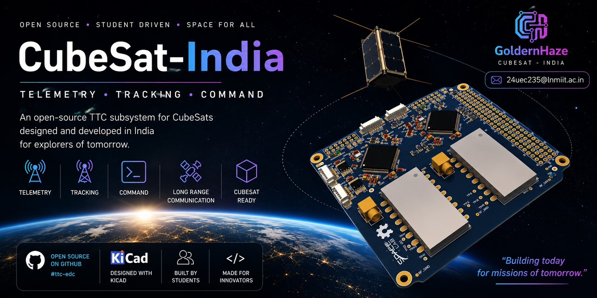

<h1 align="center">Hi 👋, I'm GoldernHaze</h1>
<h3 align="center">ECE Student | Web & Python Developer | Building with AI 🚀</h3>

---

### 👨‍🎓 About Me
- 🎓 3rd Semester **ECE student*
- 💡 I build **projects with the help of AI (ChatGPT, tools, etc.)**
- 🌐 I enjoy creating **web apps using HTML, CSS, JS, Flask, Python**
- 🧠 Strong in **DSA**, know **C**, learning **C++**
- 🔭 Currently exploring **backend, APIs & system-level thinking**
- ⚡ Believe in: *Learning by building*

---

### 🛠️ Tech Stack

#### 💻 Languages

#### 🌐 Web & Backend

#### 🧰 Tools

---

### 🚀 Featured Projects
<table>
<tr>
<td width="40%" valign="top">

## 📁 File Explorer
A modern **web-based file & media explorer** built with **Python** and **Flask**.
### ✨ Features
- 📂 Browse folders & files
- 🎥 Built-in video player
- 📄 PDF Viewer
- 🔍 Global Search
- 📤 DropX Quick Share
- ⚙️ Theme Customization
- ✏️ Text Editor
**Tech Stack**
`Python` `Flask` `HTML` `CSS` `JavaScript`
<a href="https://github.com/GoldernHaze/File-Explorer">
View Repository →
</a>
</td>
<td width="60%" align="center">

</td>
</tr>
</table>

<table>
<tr>

<td width="40%" valign="top">

## 🛰️ CubeSat Packet Pipeline
A **FreeRTOS-based packet handling pipeline** for an **S-band CubeSat transmitter**, developed during the **SpaceLab Summer Internship**.
### ✨ Features
- 📦 Payload Fragmentation
- 📡 NGHam Frame Encoding
- 🔄 FIFO Queue Management
- 📊 Real-time Telemetry
- ⚡ FreeRTOS Multi-tasking
- 🛡️ CRC16 + Reed-Solomon FEC
- 🧪 Linux POSIX Simulator
**Tech Stack**
`C` `FreeRTOS` `NGHam` `Embedded Systems` `Linux`
**Developed by**
- Hardik Singhal
- Shivansh Gupta
- Amrit Mishra
**Mentor:** Lucas Ryan
<a href="https://github.com/GoldernHaze/CubeSat-India">
View Repository →
</a>
</td>
<td width="55%" align="center">

</td>

</tr>
</table>

#### 💬 Chat App Test
- Real-time chat experimentation using **web technologies**
- Focus on learning backend + communication logic  
🔗 https://github.com/GoldernHaze/ChatAppTest

#### 🌐 Bhayankar Portfolio
- Personal portfolio website
- Built using **HTML, CSS, JavaScript, TypeScript**
- Focused on UI & presentation  
🔗 https://github.com/GoldernHaze/bhayankar-portfolio

---

### 📊 GitHub Stats

  

---

### 🌱 Currently Learning
- Advanced **DSA**
- **C++**
- Backend system design
- Better use of **AI as a development tool**

---

### 🤝 Let's Connect
- 📫 Reach me via GitHub issues or discussions
- 💬 Always open to collaboration & learning together
